# SigApp - Sistema de Información Gerencial


## Introducción

**SigApp** es una aplicación iOS nativa diseñada para la gestión de información gerencial de productos, ventas y clientes. Construida enteramente con SwiftUI, la aplicación ofrece una experiencia de usuario moderna, fluida y reactiva, siguiendo las guías de diseño de Apple.

La aplicación permite a los usuarios consultar información detallada de productos, incluyendo precios, existencias, y datos de frontera, con un sistema de caché local para funcionalidad offline.

---

## Características Principales

- **Búsqueda Avanzada de Productos:** Busca productos por código, nombre o referencia.
- **Caché Offline:** Las consultas de productos por código se guardan localmente en una base de datos Core Data. Si la API no está disponible, los datos se recuperan del caché local, garantizando la funcionalidad en todo momento.
- **Indicador de Fuente de Datos:** Un indicador visual (🌐 Online / 🗄️ Local) muestra claramente el origen de los datos del producto.
- **Consulta de Frontera:** Una pantalla dedicada para consultar información de productos directamente del sistema de frontera, con una interfaz de usuario moderna y detallada.
- **Gestión de Permisos:** La visibilidad de datos sensibles como costos y existencias está controlada por un sistema de roles y permisos.
- **Interfaz SwiftUI Nativa:** Toda la aplicación está construida con SwiftUI, asegurando un alto rendimiento y una experiencia de usuario consistente con el ecosistema de Apple.

---

## Capturas de Pantalla

| Pantalla 1 | Pantalla 2 |
| :---: | :---: |
| 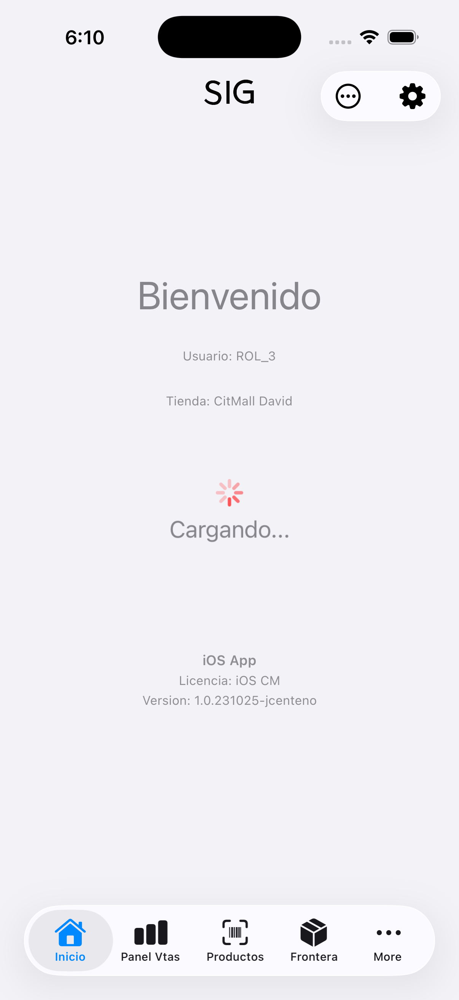 | 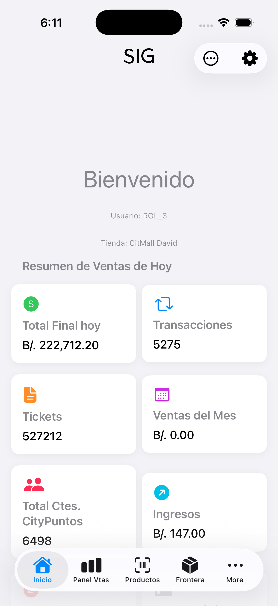 |

| Pantalla 3 | Pantalla 4 |
| :---: | :---: |
| 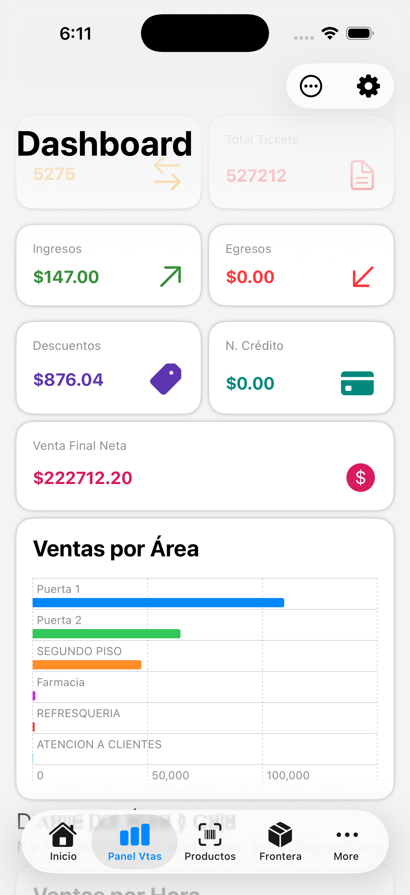 |  |

| Pantalla 5 | Pantalla 6 |
| :---: | :---: |
| 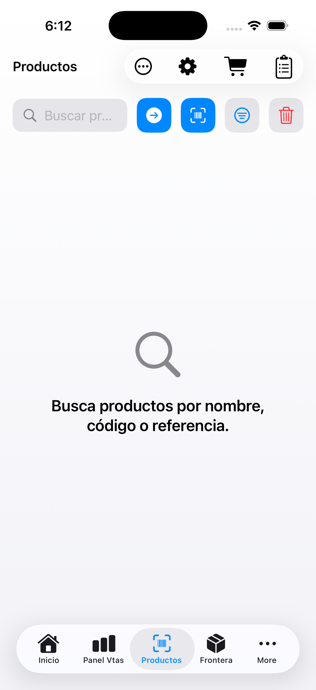 | 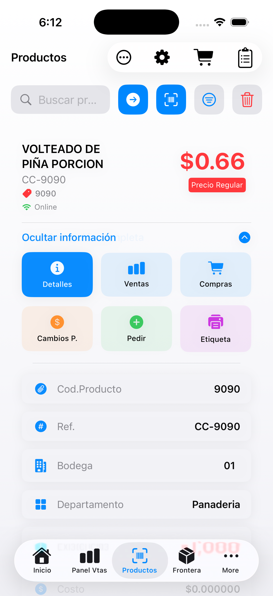 |

| Pantalla 7 | Pantalla 8 |
| :---: | :---: |
| 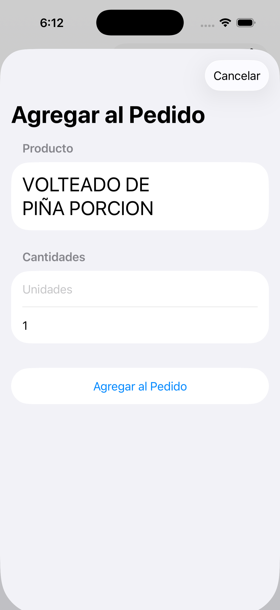 | 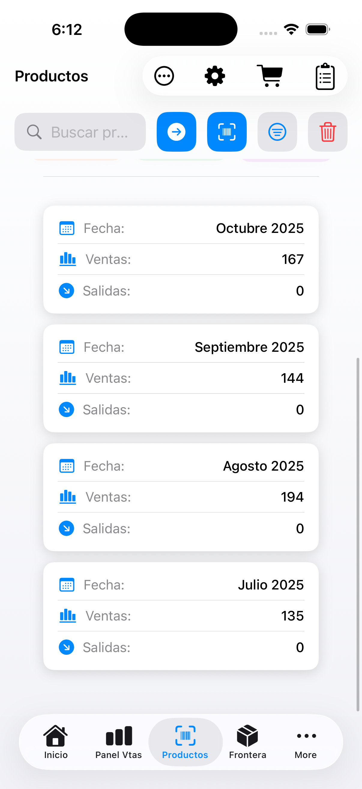 |

| Pantalla 9 | Pantalla 10 |
| :---: | :---: |
| 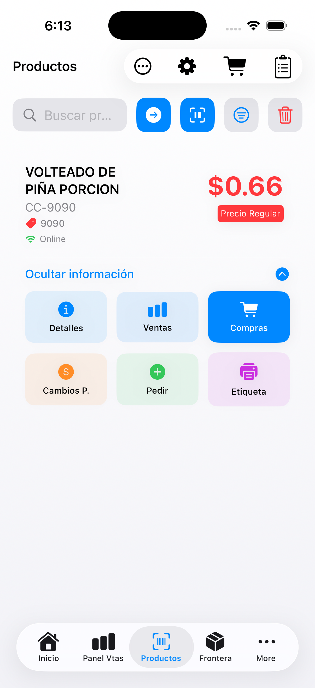 | 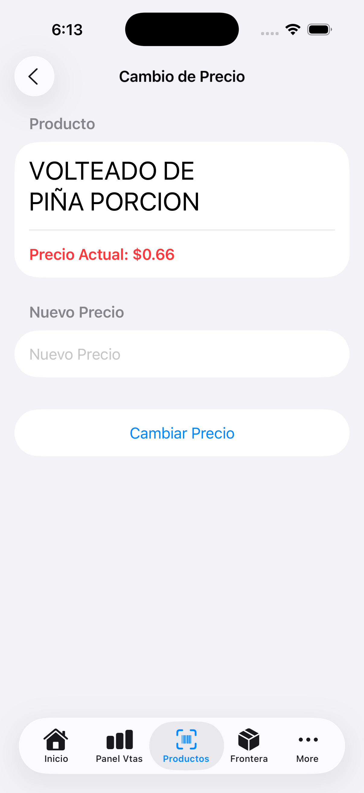 |

| Pantalla 11 | Pantalla 12 |
| :---: | :---: |
| 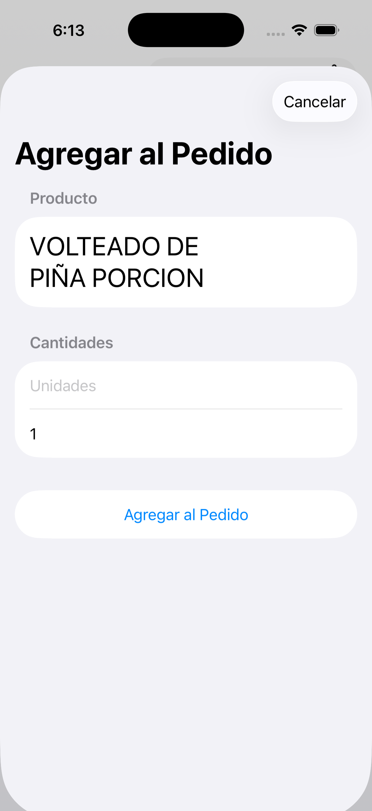 | 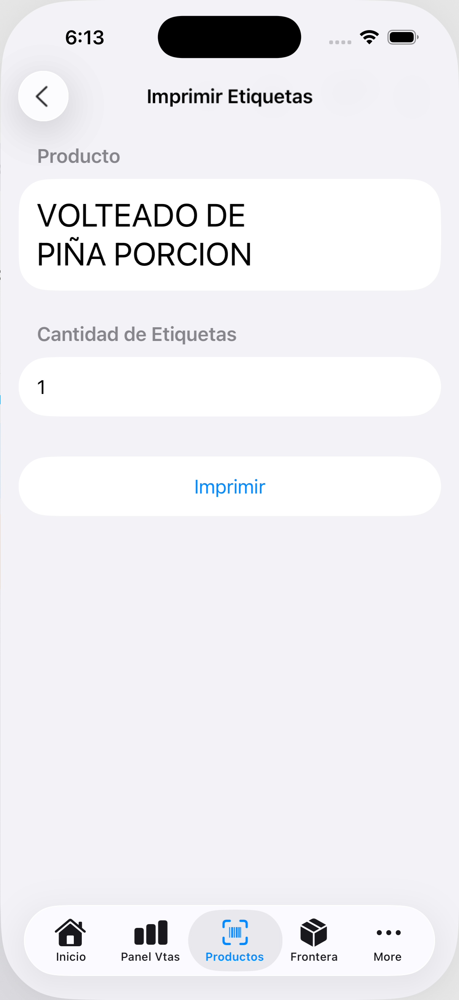 |

| Pantalla 13 | Pantalla 14 |
| :---: | :---: |
| 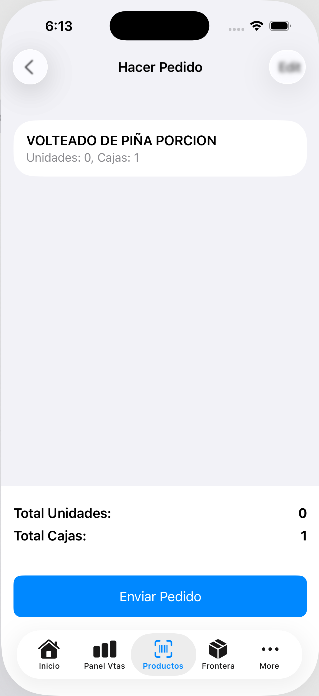 | 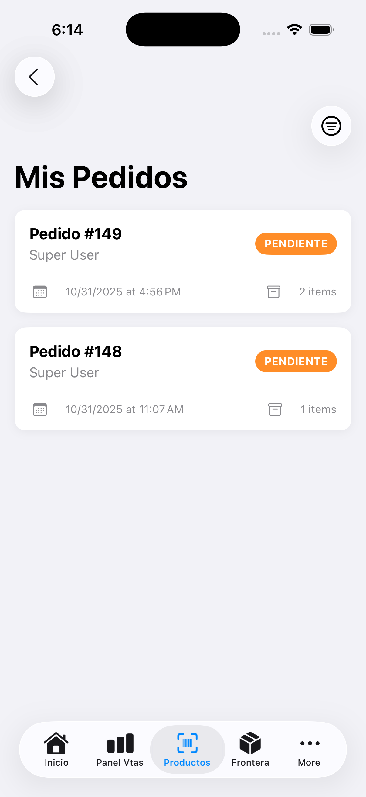 |

| Pantalla 15 | Pantalla 16 |
| :---: | :---: |
| 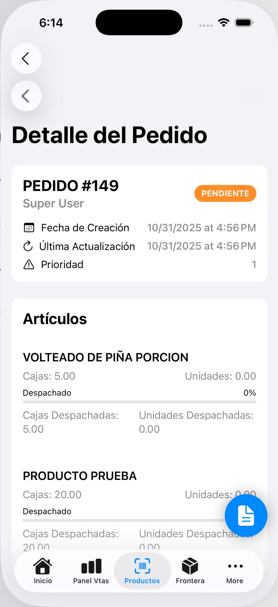 | 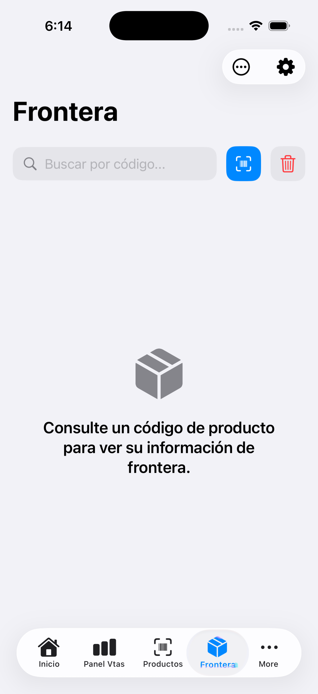 |

| Pantalla 17 |
| :---: |
| 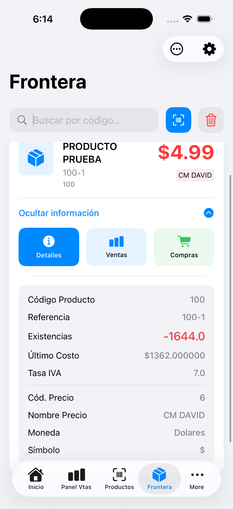 |
---

## Arquitectura

La aplicación sigue una arquitectura moderna y escalable, basada en los siguientes patrones:

- **MVVM (Model-View-ViewModel):** Separa la lógica de la interfaz de usuario (View) de la lógica de negocio y presentación (ViewModel), facilitando el mantenimiento y las pruebas.
- **Patrón Repositorio:** Se utiliza un `ProductRepository` para abstraer las fuentes de datos. El ViewModel solicita datos al Repositorio, que decide si obtenerlos de la API o del caché local de Core Data.
- **Inyección de Dependencias:** Se utiliza para desacoplar los componentes, como inyectar el `ProductRepository` en el `ProductViewModel`.

```mermaid
graph TD
    A[View (SwiftUI)] -- "Acciones" --> B(ViewModel);
    B -- "Solicita Datos" --> C{Repository};
    C -- "Intenta API" --> D[APIService];
    D -- "Falla" --> C;
    C -- "Intenta Caché" --> E[CoreDataStack];
    E -- "Devuelve Datos Locales" --> C;
    D -- "Devuelve Datos API" --> C;
    C -- "Guarda en Caché" --> E;
    C -- "Devuelve (Producto, Fuente)" --> B;
    B -- "Actualiza Estado" --> A;
```

---

## Cómo Empezar

Para compilar y ejecutar el proyecto, sigue estos pasos:

1.  Clona el repositorio en tu máquina local.
2.  Abre el archivo `iOsSig.xcodeproj` en Xcode.
3.  Selecciona un simulador de iOS o un dispositivo físico.
4.  Presiona `Cmd + R` o el botón de "Run" para compilar y ejecutar la aplicación.

---

## Tecnologías Utilizadas

- **SwiftUI:** Para toda la interfaz de usuario.
- **Combine:** Para la programación reactiva y el manejo de eventos asíncronos.
- **Core Data:** Para la persistencia de datos y el caché offline.
- **URLSession:** Para la comunicación con las APIs REST.
